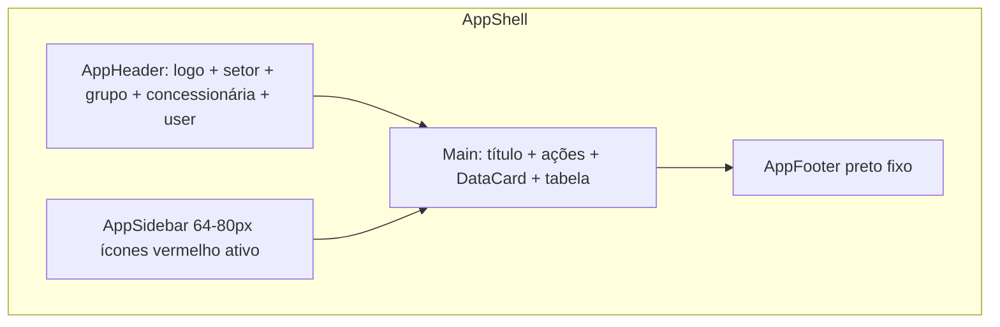

# Plano de Implementação — SerNissan

## Regra obrigatória — Migrations e MCP

- **Não aplicar migrations grandes via MCP chunkado.**
- Para migrations, usar **preferencialmente Supabase CLI** (`supabase db push` após `supabase login` + `supabase link`).
- O MCP pode ser usado para **diagnóstico**, leitura de metadados, advisors e conferência pós-CLI.
- **Não usar MCP `apply_migration` ou `execute_sql` DDL** para `0001_initial_schema.sql` (~381 KB).

---

## 1. Diagnóstico inicial

### Arquivos lidos

Documentação obrigatória e regras:

- [AGENTS.md](AGENTS.md), [README.md](README.md), [PASSO_A_PASSO_ANTES_DO_CURSOR.md](PASSO_A_PASSO_ANTES_DO_CURSOR.md)
- [docs/00-prd-funcional.md](docs/00-prd-funcional.md), [docs/02-modelo-dados-supabase.md](docs/02-modelo-dados-supabase.md), [docs/03-option-sets.md](docs/03-option-sets.md)
- [docs/04-mapa-telas-modulos.md](docs/04-mapa-telas-modulos.md), [docs/05-workflows-backend.md](docs/05-workflows-backend.md), [docs/06-arquitetura-stack.md](docs/06-arquitetura-stack.md)
- [docs/07-cursor-start-here.md](docs/07-cursor-start-here.md), [docs/11-setup-antes-do-cursor.md](docs/11-setup-antes-do-cursor.md)
- [docs/13-guia-visual-ux-ui.md](docs/13-guia-visual-ux-ui.md), [docs/14-design-system-componentes.md](docs/14-design-system-componentes.md)
- [docs/15-arquitetura-codigo-nextjs.md](docs/15-arquitetura-codigo-nextjs.md), [docs/16-plano-implementacao-fases.md](docs/16-plano-implementacao-fases.md)
- [docs/17-supabase-seguranca-rls.md](docs/17-supabase-seguranca-rls.md), [docs/18-checklist-qa-release.md](docs/18-checklist-qa-release.md)
- [docs/08-regras-negocio.md](docs/08-regras-negocio.md)
- [supabase/migrations/0001_initial_schema.sql](supabase/migrations/0001_initial_schema.sql) (~86 tabelas, seeds `app_options`, índices)
- [supabase/migrations/0002_dev_rls_draft_review_before_prod.sql](supabase/migrations/0002_dev_rls_draft_review_before_prod.sql) (RLS draft permissivo)
- [.cursor/rules/*.mdc](.cursor/rules/) (10 regras: overview, supabase, nextjs, tests, UX, plan-mode, security, architecture, schema)
- [cursor-tasks/FASE-01-FUNDACAO.md](cursor-tasks/FASE-01-FUNDACAO.md), [cursor-tasks/FASE-04-BIBLIOTECA-INDICADORES.md](cursor-tasks/FASE-04-BIBLIOTECA-INDICADORES.md)

### Estado atual do repositório

| Aspecto | Estado |
|---------|--------|
| Código Next.js | **Inexistente** — não há `package.json`, `src/` ou `app/` |
| Git | Repositório inicializado; commit de documentação |
| Documentação | Pacote v2 completo (docs, prompts, rules, migrations SQL) |
| Supabase local | `supabase init` feito → [supabase/config.toml](supabase/config.toml) |
| Supabase CLI link | **Pendente** — requer `supabase login` ou `SUPABASE_ACCESS_TOKEN` |
| `.env.local` | Presente (não versionado); aponta para projeto QA |
| `.gitignore` | Criado a partir de `.gitignore.recommended` |
| Tipos TS | `src/lib/supabase/database.types.ts` **não existe** |
| Referências visuais | PDF + screenshot em `references/` (citados no README) |
| Artefatos temporários | `supabase/.temp/` removido na **Fase 0A** (2026-06-26) |

### Estado da conexão Supabase/MCP (somente leitura)

| Item | Valor |
|------|-------|
| MCP conectado | **Sim** (`user-supabase`) |
| Project URL | `https://hdydlpeyzaubpxtokalb.supabase.co` |
| Project Ref | `hdydlpeyzaubpxtokalb` |
| Schemas visíveis | `auth`, `public`, `storage`, `realtime`, `extensions`, `vault`, etc. |
| Tabelas em `public` | **0** (banco remoto ainda vazio) |
| Migrations aplicadas (remoto) | **0** |
| Migrations locais | `0001_initial_schema.sql`, `0002_dev_rls_draft_review_before_prod.sql` |
| Advisors segurança | WARN: extensão `citext` no schema `public` |
| Permissões MCP | Leitura OK; escrita disponível (não usar até fase aprovada) |

### Riscos encontrados

1. **Drift repo ↔ banco**: migrations locais prontas, remoto vazio — schema deve ser aplicado de forma controlada na Fase 0.
2. **RLS draft permissivo**: `0002` usa `using (true)` para `authenticated` — adequado só para dev/QA inicial; **proibido em produção**.
3. **Schema inferido do Bubble**: nomes com aspas (`"rv"`, `"loh"`), tabelas legadas (`competencia_mapa1/2`) — revisar durante implementação.
4. **Migration grande (~381 KB)**: **obrigatório** Supabase CLI (`db push`); **proibido** MCP chunkado.
5. **Regras de negócio complexas no placar**: 2147 elementos no Bubble — maior risco técnico; exige jobs idempotentes e testes unitários.
6. **RV público**: token, expiração, assinatura auditável — superfície de segurança crítica.
7. **Sem app ainda**: toda a stack de testes/lint será criada do zero na Fase 0/1.

### Dúvidas pendentes (ver seção 9)

---

## 2. Stack final confirmada

| Tecnologia | Papel | Por quê |
|------------|-------|---------|
| **Next.js 15 App Router** | Rotas, layouts, SSR, Server Actions | Server Components por padrão; alinhado ao [docs/15](docs/15-arquitetura-codigo-nextjs.md) |
| **TypeScript strict** | Tipagem end-to-end | Segurança em queries, actions e permissões |
| **Supabase Auth** | Login, reset, sessão | Substitui auth Bubble; cookies SSR |
| **Supabase Postgres** | Dados relacionais | 86 tabelas + joins N:N já modelados |
| **Supabase Storage** | Avatares, logos, anexos RV | Privado + signed URLs |
| **Supabase RLS** | Autorização no banco | Obrigatório; complementa `lib/permissions` |
| **Supabase SSR** (`@supabase/ssr`) | Clientes server/browser | Middleware de sessão; sem service role no client |
| **Tailwind CSS** | Estilização utilitária | Tokens SerNissan (`--sn-red`, `--sn-bg`, etc.) |
| **shadcn/ui + Radix** | Componentes acessíveis | Base para tabelas, dialogs, switches |
| **Zod** | Validação | Server Actions, forms, Edge Functions |
| **React Hook Form** | Formulários densos | CRUDs admin, RV, competências |
| **TanStack Table** | Tabelas administrativas | Paginação/filtros server-side via URL |
| **TanStack Query** | Cache client-side | Somente onde interação realtime/cache justificar |
| **FullCalendar** | Agenda | Substitui plugin Bubble |
| **Recharts** | Gráficos placar/dashboard | Dashboards e performance |
| **date-fns** | Datas pt-BR | Formatação consistente |
| **Vitest + Testing Library** | Unit/component tests | Cálculos, permissões, schemas |
| **Playwright** | E2E | Login, indicadores, competências, RV |
| **Supabase Edge Functions** | E-mail, CSV, jobs pesados | Workflows de [docs/05](docs/05-workflows-backend.md) |
| **ESLint + Prettier** | Qualidade | CI mínimo desde Fase 0 |

---

## 3. Arquitetura de pastas proposta

Baseada em [docs/15-arquitetura-codigo-nextjs.md](docs/15-arquitetura-codigo-nextjs.md) e [docs/06-arquitetura-stack.md](docs/06-arquitetura-stack.md):

```txt
src/
  app/
    (auth)/
      entrar/page.tsx
      resetar-senha/page.tsx
    (app)/
      layout.tsx                    # AppShell autenticado
      page.tsx                      # Home/Início
      biblioteca-indicadores/
      indicadores/
      placar/
      competencias/
      solicitacoes/
      usuarios/
      equipe/
      visitas/
      agenda/
      reuniao-resultados/
      habitos/
      preferencias/
      admin/
        empresa/
        paises/
        divisoes/
        setores/
        grupos/
        concessionarias/
        areas-funcoes/
    rv-publico/[token]/page.tsx     # Assinatura pública
    termos/page.tsx
    api/webhooks/                   # Cron, imports
  components/
    app-shell/                      # AppShell, Header, Sidebar, Footer
    data-table/                     # ServerDataTable, InlineEditableCell
    forms/
    ui/                             # shadcn
  features/
    auth/
    organizational-context/
    permissions/
    admin/
    indicadores/
    placar/
    competencias/
    solicitacoes/
    usuarios/
    visitas/
    agenda/
    reuniao-resultados/
  lib/
    supabase/                       # client, server, middleware, database.types
    permissions/
    validations/
    utils/
  server/
    queries/
    actions/
    jobs/
    rpc/
  tests/
    unit/
    e2e/
supabase/
  migrations/
  functions/
  seed/                             # seeds dev (profiles, empresa demo)
.cursor/plans/                      # plano aprovado
```

**Convenções-chave:**
- `app/` = composição de rotas (Server Components)
- `features/` = domínio (componentes + schemas Zod)
- `server/queries` = leitura paginada
- `server/actions` = mutations
- `lib/permissions` = `requireCurrentUser`, `assertCan`, escopo organizacional

---

## 4. Fases de implementação

### Fase 0A — Recuperação e preparação

**Objetivo:** Garantir que o banco QA está limpo e o ambiente pronto **antes** de qualquer migration ou bootstrap.

**Escopo (somente diagnóstico/preparação):**
- Verificar se há query travada (`pg_stat_activity` com `state = active` de longa duração)
- Verificar locks não concedidos (`pg_locks WHERE NOT granted`)
- Verificar se `public` continua vazio (0 tabelas)
- Verificar se não existe migration parcial aplicada (`list_migrations`, schema `supabase_migrations`)
- Limpar `supabase/.temp/` (artefatos da tentativa MCP chunkada)
- Confirmar Project Ref `hdydlpeyzaubpxtokalb`
- Confirmar ambiente QA (nunca produção)
- Confirmar `.env.local` ignorado pelo Git (não commitar)
- Tentar/confirmar Supabase CLI linkado (`supabase link`)
- **Não aplicar migration**
- **Não alterar RLS**
- **Não criar app Next.js**

**Critérios de aceite:**
- Banco sem queries ativas travadas
- Sem locks bloqueantes
- `public` vazio, 0 migrations registradas
- `supabase/.temp/` removido
- Relatório 0A entregue

**Status:** concluída em 2026-06-26.

---

### Fase 0B — Bootstrap e schema QA

**Objetivo:** Repositório executável, banco QA com schema, tipos TS, buckets e CLI linkado — sem telas de negócio.

**Pré-requisito:** Fase 0A aprovada; `supabase login` executado pelo operador.

**Arquivos criados/editados:**
- `package.json`, `pnpm-lock.yaml`, `tsconfig.json`, `next.config.ts`, `tailwind.config.ts`, `postcss.config.js`
- `components.json` (shadcn), `.eslintrc`, `vitest.config.ts`, `playwright.config.ts`
- `src/lib/supabase/{client,server,middleware}.ts`
- `src/lib/supabase/database.types.ts` (gerado)
- `supabase/seed/dev.sql` (empresa/concessionária/usuários QA)

**Migrations (via Supabase CLI, não MCP):**
1. `supabase link --project-ref hdydlpeyzaubpxtokalb`
2. `supabase db push` → aplica `0001_initial_schema.sql`
3. `supabase db push` → aplica `0002_dev_rls_draft_review_before_prod.sql` (**somente QA**)

**Componentes:** nenhum de produto ainda.

**Tabelas Supabase:** 86 tabelas + seeds `app_options` + índices.

**RLS:** `0002` draft permissivo — **QA only**.

**Testes:** `pnpm lint`, `pnpm typecheck`, build/smoke quando possível.

**Critérios de aceite:**
- `pnpm dev` sobe (página placeholder)
- 86 tabelas em `public` no QA
- `database.types.ts` gerado
- Buckets privados: `avatars`, `logos`, `rv-anexos`, `uploads`
- CLI linkado ao project ref QA
- Relatório final 0B entregue

**Riscos:** migration grande (~381 KB) — mitigar exclusivamente via CLI; nunca MCP chunkado.

---

### Fase 1 — Layout base, design system e autenticação

**Objetivo:** Shell visual SerNissan + auth Supabase funcional.

**Arquivos:**
- `src/app/(auth)/entrar/page.tsx`, `resetar-senha/page.tsx`
- `src/app/(app)/layout.tsx`, `page.tsx`
- `src/components/app-shell/{AppShell,AppHeader,AppSidebar,AppFooter}.tsx`
- `src/components/ui/*` (Button, Input, Select, Switch, Dialog, Tooltip)
- `src/middleware.ts` (sessão Supabase)
- `src/features/auth/{LoginForm,ResetPasswordForm}.tsx`
- `src/lib/validations/auth.ts`
- `src/server/actions/auth.ts`
- `src/app/globals.css` (tokens `--sn-*`)

**Componentes:** AppShell, PageTitleActions, DataCard, LoadingState, EmptyState, ErrorState, UserAvatar, StatusSwitch.

**Tabelas:** `profiles` (leitura pós-login), `auth.users` (trigger/hook de criação de profile).

**Server Actions:** `signInAction`, `signOutAction`, `resetPasswordAction`, `updateOwnProfileAction`.

**Queries:** `getCurrentUser()`, `getProfileByAuthId()`.

**Zod:** `SignInSchema`, `ResetPasswordSchema`.

**RLS:** profiles — manter update own; demais tabelas ainda com draft dev.

**Testes:** Vitest schemas auth; Playwright login/logout smoke.

**Critérios de aceite:**
- Login/logout/reset funcionam
- Layout com header (logo, seletores mock), sidebar compacta vermelha, footer preto, fundo `#f2f2f2`
- Middleware redireciona não autenticado
- Desktop 1280px+ legível

**Riscos:** trigger `profiles` vs `profiles.id = auth.uid()` — validar FK em `0001`.

---

### Fase 2 — Contexto organizacional e permissões

**Objetivo:** Usuário navega com escopo correto; menu lateral filtrado por perfil.

**Arquivos:**
- `src/lib/permissions/{index,actions,scopes}.ts`
- `src/features/organizational-context/{ContextProvider,HeaderSelectors}.tsx`
- `src/server/queries/organizational-context.ts`
- `src/server/actions/set-context.ts` (cookie/session de contexto)
- `src/lib/validations/context.ts`
- Migration `0003_rls_helpers.sql` (funções `current_profile_level`, `can_access_concessionaria`, etc.)

**Componentes:** seletores Setor/Grupo/Concessionária no header; sidebar dinâmica via `app_options.pages`.

**Tabelas:** `profiles`, `empresa`, `setores`, `grupo`, `concessionaria`, `setor_concessionaria`, `funcao_colaborador`, join tables (`profiles_grupos_disponiveis`, `profiles_concessionarias_equipe`, `profiles_areas_disponiveis`), `app_options`.

**Server Actions:** `setOrganizationalContextAction`.

**Queries:** `getAllowedModules(user)`, `getContextOptions(user)`, `getSidebarItems(user)`.

**Zod:** `OrganizationalContextSchema`.

**RLS:** iniciar substituição gradual do draft — policies de leitura escopadas em `concessionaria`, `grupo`, `profiles`.

**Testes:** unit `assertCan`, `getAllowedScopes`; matriz perfil × rota.

**Critérios de aceite:**
- Troca de contexto recarrega dados escopados
- Menu oculta módulos acima de `max_nivel` (option set `pages`)
- Usuário inativo/aprovado=false bloqueado

**Riscos:** lógica de escopo N:N complexa; mapear de [docs/08](docs/08-regras-negocio.md).

---

### Fase 3 — CRUDs administrativos base

**Objetivo:** Cadastros estruturais com tabelas densas paginadas.

**Arquivos (por entidade):**
- `src/app/(app)/admin/{empresa,paises,divisoes,setores,grupos,concessionarias,areas-funcoes,usuarios}/page.tsx`
- `src/features/admin/{entity}/{Table,FormDialog,Filters}.tsx`
- `src/server/queries/admin/*.ts`
- `src/server/actions/admin/*.ts`
- `src/lib/validations/admin/*.ts`

**Componentes:** ServerDataTable, FilterSelect, SearchInput, IconButton, ConfirmDialog.

**Tabelas:** `empresa`, `pais`, `divisao`, `setores`, `grupo`, `grupo_ndp`, `concessionaria`, `setor_concessionaria`, `funcao_colaborador`, `profiles` + joins (`pais_divisoes`, `divisao_setores`, `grupo_concessionarias`, etc.).

**Server Actions:** create/update/delete/archive por entidade; convite usuário (stub e-mail Fase 10).

**Queries:** listagens paginadas com filtros por escopo; colunas explícitas (sem `select('*')`).

**Zod:** schemas por entidade (ex.: `ConcessionariaSchema` com BIR, UF, domínios).

**RLS:** escrita restrita por `perfil` nível; leitura escopada.

**Testes:** Vitest validations; Playwright CRUD concessionária (1 fluxo).

**Critérios de aceite:**
- CRUD completo das 8 entidades admin base
- Paginação server-side + filtros no banco
- Permissões por perfil validadas server-side

**Riscos:** hierarquia circular (pais ↔ dashboard_options); forms com muitos FKs.

---

### Fase 4 — Biblioteca de indicadores

**Objetivo:** Reproduzir `/biblioteca-indicadores` fiel ao screenshot Bubble.

**Arquivos:**
- `src/app/(app)/biblioteca-indicadores/page.tsx`
- `src/features/indicadores/{IndicatorLibraryTable,IndicatorFormDialog,IndicatorFilters,IndicatorActiveSwitch}.tsx`
- `src/server/queries/indicadores/library.ts`
- `src/server/actions/indicadores/{create,update,delete,check}.ts`
- `src/lib/validations/indicadores/library.ts`

**Componentes:** InlineEditableCell, MetricWeightSelect, drag handle (ordem).

**Tabelas:** `indicadores` (biblioteca/admin), `indicadores_areas`, `indicadores_funcoes`, `setor_concessionaria`, `funcao_colaborador`, `app_options` (unidade, importância).

**Server Actions:** CRUD indicador; `checkIndicatorsAction` (job leve); copy ID.

**Queries:** filtros área/função/nome/sigla paginados; joins para áreas/funções.

**Zod:** `IndicatorLibrarySchema` (nome, sigla, api_id, peso, meta, unidade, ativo).

**RLS:** indicadores admin — escrita perfil Nissan/grupo; leitura escopada.

**Testes:** Playwright biblioteca (filtros, criar, toggle ativo); screenshot visual compare.

**Critérios de aceite:**
- Visual comparável a [references/screenshots/biblioteca-indicadores.png](references/screenshots/biblioteca-indicadores.png)
- Colunas: Nome, Sigla, API, Áreas, Funções, Peso, Unidade, Meta, Ativo, ações
- Botões pretos `+ Indicador`, `Checar indicadores`

**Riscos:** inline edit concorrente; debounce + optimistic UI controlado.

---

### Fase 5 — Indicadores e objetivos

**Objetivo:** Tela operacional de indicadores por concessionária + solicitações.

**Arquivos:**
- `src/app/(app)/indicadores/page.tsx`
- `src/features/indicadores/{IndicatorObjectiveTable,IndicatorRequestDialog}.tsx`
- `src/server/queries/indicadores/objectives.ts`
- `src/server/actions/indicadores/{request,approve,reject}.ts`

**Tabelas:** `indicadores`, `solicitacoes`, `placar`, `concessionaria`.

**Server Actions:** solicitar indicador; aprovar/rejeitar; editar meta/peso/ativo inline.

**Queries:** contador solicitações pendentes; listagem por concessionária/contexto.

**Zod:** `IndicatorRequestSchema`, `IndicatorObjectiveUpdateSchema`.

**RLS:** `solicitacoes` escopadas; aprovação por perfil.

**Testes:** fluxo solicitação completo E2E.

**Critérios de aceite:**
- Badge "N indicadores solicitados"
- Botões vermelhos refresh/biblioteca; preto `+ Solicitar Indicador`

---

### Fase 6 — Placar e rankings

**Objetivo:** Substituir cálculos Bubble por banco + jobs idempotentes.

**Arquivos:**
- `src/app/(app)/placar/page.tsx`
- `src/features/placar/*` (ScoreboardHeader, RankingTable, IndicatorTable, RecalculateButton)
- `src/server/jobs/placar/{recalculate-points,recalculate-ranking,create-placar}.ts`
- `src/server/rpc/placar/*.sql` (migration views/RPCs)
- Migration `0004_placar_views.sql`

**Tabelas:** `placar`, `indicadores`, join tables (`placar_indicadores`, `placar_colaboradores_start`, `concessionaria_placars`), `feedback`, `placar_exclus_o`.

**Server Actions:** criar/finalizar placar; atualizar valor/meta; customizar meta + justificativa; trigger recálculo.

**Queries:** rankings por colaborador/função/área; resumo cards.

**Zod:** `PlacarSchema`, `IndicatorValueUpdateSchema`, `CustomMetaSchema` (exige justificativa).

**RLS:** placar/indicadores por concessionária.

**Testes:** **unit crítico** — cálculo pontos/ranking; job idempotência; performance com dataset grande.

**Critérios de aceite:**
- Recálculo não duplica pontos
- `ranking_atualizado` consistente
- Telas responsivas com paginação

**Riscos:** **maior complexidade do projeto** — fase mais longa; considerar subfases 6a (CRUD placar) e 6b (jobs/RPC).

---

### Fase 7 — Competências e calibração

**Objetivo:** Matriz visual Sim/Parcial/Não com cores corporativas.

**Arquivos:**
- `src/app/(app)/competencias/page.tsx` (+ subrotas mapa/calibração se necessário)
- `src/features/competencias/{CompetencyMatrix,CompetencyCell,CollaboratorCard,PdfButton}.tsx`
- `src/server/queries/competencias/*.ts`
- `src/server/actions/competencias/*.ts`

**Tabelas:** `competencia_mapa`, `competencia_habito`, `competencia_calibracao`, `calibracao_resultado`, joins (`competencia_calibracao_mapas`, `competencia_mapa_habitos`, etc.).

**Server Actions:** salvar célula matriz; avançar etapas (autocalibração/líder/follow-up); export PDF (Edge Function ou server).

**Queries:** matriz por colaborador/função/área; histórico calibração.

**Zod:** `CalibrationCellSchema`, `CalibrationStageSchema`.

**RLS:** calibração por concessionária/colaborador.

**Testes:** visual cores (`--sn-green-soft`, `--sn-yellow-soft`, `--sn-red-soft`); Playwright editar célula.

**Critérios de aceite:**
- Matriz densa preservada
- Card colaborador com foto, áreas, funções, última atualização
- Botões: PDF, colaboradores, performance

---

### Fase 8 — Solicitações de cadastro e inclusão

**Objetivo:** Fluxos de onboarding e inclusão em concessionária.

**Arquivos:**
- `src/app/(app)/solicitacoes/page.tsx`
- `src/features/solicitacoes/{RegistrationRequestsTable,InclusionRequestsTable,RequestReviewDialog}.tsx`

**Tabelas:** `solicitacoes`, `profiles`, `concessionaria`.

**Server Actions:** aprovar/rejeitar cadastro; processar inclusão.

**Queries:** duas listagens paginadas (cadastro vs inclusão).

**Zod:** `RegistrationRequestReviewSchema`.

**RLS:** solicitações visíveis por perfil admin escopado.

**Testes:** E2E aprovar solicitação.

---

### Fase 9 — Visitas/RV, reunião de resultados, agenda e hábitos

**Objetivo:** Módulos complementares mapeados no Bubble.

**Subfases recomendadas:**

**9a — Visitas/RV (prioridade alta):**
- Rotas: `/visitas`, `/rv-publico/[token]`
- Tabelas: `rv`, `rv_participante`, `rv_proximo_passo`, `rv_anexo`, `rv_assinatura`, `rv_auditoria`, `rv_foco`, `rv_modalidade`
- Server Actions: CRUD visita; gerar token; assinar (público via route handler validando token)
- **Segurança:** token aleatório, expiração, hash SHA256, bloqueio pós-assinatura; **não** expor UUIDs na URL pública

**9b — Reunião de resultados:**
- Rota `/reuniao-resultados`
- Tabelas XR: `xr_placar`, `xr_acao`, `xr_meta`, `rr_indicadores`, `xr_indicador_resultado`, `xr_resultado_final`, `xr_simulador`, etc.

**9c — Agenda:**
- Rota `/agenda` com FullCalendar
- Tabelas: `agendamentos`, `agendamentos_users`, `agendamentos_convidados`

**9d — Hábitos:**
- Rota `/habitos` (admin)
- Tabela: `habitos`, `competencia_habito`

**Testes:** E2E RV público (token válido/expirado/assinado).

---

### Fase 10 — QA, segurança, performance e deploy

**Objetivo:** Homologação e hardening.

**Entregáveis:**
- Migration `0005_rls_production.sql` — **substituir** policies dev permissivas
- Revisão Storage policies
- Edge Functions: e-mail (Brevo/Resend), CSV import, cron inatividade
- Sentry opcional
- CI: lint, typecheck, test, build
- Deploy Vercel preview + checklist [docs/18](docs/18-checklist-qa-release.md)
- Documentação atualizada

**Testes:** suite Playwright crítica; testes RLS por perfil; load test placar (opcional).

**Critérios de aceite:** QA manual aprovado; zero policy `using (true)` em prod; advisors Supabase limpos.

---

## 5. Plano visual/UX

Referência: [docs/13-guia-visual-ux-ui.md](docs/13-guia-visual-ux-ui.md) + [docs/14-design-system-componentes.md](docs/14-design-system-componentes.md).

### Layout autenticado (AppShell)



### Tokens CSS (globals.css)

- Fundo: `#f2f2f2` (`--sn-bg`)
- Cards: branco, sombra leve
- Botão primário: preto `#000`
- Botão destaque: vermelho Nissan `#c3002f`
- Inputs: fundo `#f5f5f5`, compactos
- Switch ativo: preto; inativo: cinza
- Matriz competências: verde/amarelo/vermelho suaves

### Regras de fidelidade Bubble

- **Não** usar UI SaaS genérica (cards espaçados demais, tipografia Inter default sem ajuste)
- Tabelas **densas** — altura de linha compacta, scroll horizontal
- Header sempre visível com contexto organizacional
- Sidebar nunca larga — priorizar área da tabela
- Footer preto em todas as páginas autenticadas
- Desktop first (min 1280px); mobile = scroll horizontal, não reflow para cards na v1

### Componentes obrigatórios (Fase 1–2)

AppShell, AppHeader, AppSidebar, AppFooter, PageTitleActions, DataCard, ServerDataTable, SearchInput, FilterSelect, StatusSwitch, IconButton, UserAvatar, CompetencyMatrix, EmptyState, LoadingState, ErrorState.

---

## 6. Plano de Supabase

### Migrations (ordem)

| # | Arquivo | Conteúdo |
|---|---------|----------|
| 1 | `0001_initial_schema.sql` | 86 tabelas, FKs, seeds `app_options`, índices |
| 2 | `0002_dev_rls_draft_review_before_prod.sql` | RLS dev permissivo — **QA only** |
| 3 | `0003_rls_helpers.sql` | Funções `current_profile_level`, `can_access_*` |
| 4 | `0004_placar_views.sql` | Views/RPCs ranking e resumo |
| 5 | `0005_rls_production.sql` | Policies finais por perfil/escopo |
| 6 | `0006_job_queue.sql` | `job_queue`, `job_logs` (workflows pesados) |

### Tipos TypeScript

```bash
npx supabase gen types typescript --project-id "$SUPABASE_PROJECT_REF" --schema public > src/lib/supabase/database.types.ts
```

Regenerar após cada migration. Nunca editar manualmente.

### RLS (estratégia)

1. **QA inicial:** `0002` draft (authenticated full access) — acelerar dev
2. **Fase 2+:** substituir gradualmente por policies escopadas
3. **Pré-prod:** `0005` remove todo `using (true)` operacional
4. **RV público:** route handler + função SECURITY DEFINER que valida token — não policy aberta na tabela `rv`

Helpers SQL conforme [docs/17](docs/17-supabase-seguranca-rls.md).

### Buckets Storage (privados)

| Bucket | Uso |
|--------|-----|
| `avatars` | Fotos profiles |
| `logos` | Logos empresa/concessionária |
| `rv-anexos` | Anexos visita |
| `uploads` | CSV imports temporários |

Policies: upload autenticado escopado; download via signed URL.

### Seeds

- `0001` já inclui seeds extensos de `app_options` (option sets, pages, perfis, unidades, status visita, etc.)
- Criar `supabase/seed/dev.sql`: 1 empresa demo, 1 concessionária, usuários por perfil (Nissan, grupo, dealer, área, colaborador)

### Ambientes

| Ambiente | Project | Uso |
|----------|---------|-----|
| **QA/Dev** | `hdydlpeyzaubpxtokalb` | Desenvolvimento e testes agente |
| **Staging** | criar depois | Homologação usuários reais |
| **Produção** | criar depois | Só após RLS production + QA |

**Regra:** nunca conectar MCP/CLI de dev diretamente em produção.

---

## 7. Plano de testes

### Unitários (Vitest)

- Schemas Zod (todas features)
- `lib/permissions` — matriz perfil × ação × escopo
- Cálculo pontos/ranking placar
- Validação token RV (expiração, status)
- Helpers de paginação/filtros

### Componentes (Testing Library)

- ServerDataTable (render, empty, loading)
- StatusSwitch, InlineEditableCell
- CompetencyCell (cores por status)
- LoginForm (validação client)

### E2E (Playwright)

| Fluxo | Fase |
|-------|------|
| Login/logout/reset | 1 |
| Troca contexto header | 2 |
| CRUD concessionária | 3 |
| Biblioteca indicadores (CRUD + filtros) | 4 |
| Solicitar/aprovar indicador | 5 |
| Criar placar + recalcular | 6 |
| Editar célula competências | 7 |
| RV público assinar + token expirado | 9a |
| Smoke navegação sidebar | 2 |

### Permissão

- Fixtures: 6 perfis de [docs/00](docs/00-prd-funcional.md)
- Testar rota proibida → 403/forbidden page
- Testar RLS: usuário A não lê dados concessionária B

### Performance

- Listagem indicadores: 1000+ rows paginadas < 500ms query
- Placar ranking: RPC/view vs N+1
- Lighthouse desktop nas telas principais (meta: LCP < 2.5s)

---

## 8. Ordem de execução recomendada

```mermaid
flowchart LR
  F0A[Fase0A Recuperação] --> F0B[Fase0B Bootstrap+Schema CLI]
  F0B --> F1[Fase1 Layout+Auth]
  F1 --> F2[Fase2 Contexto+Permissões]
  F2 --> F3[Fase3 CRUDs Admin]
  F3 --> F4[Fase4 Biblioteca Indicadores]
  F4 --> F5[Fase5 Indicadores Objetivos]
  F5 --> F6[Fase6 Placar]
  F6 --> F7[Fase7 Competências]
  F7 --> F8[Fase8 Solicitações]
  F8 --> F9[Fase9 RV+Agenda+XR]
  F9 --> F10[Fase10 QA+Deploy]
```



**Executar primeiro:** Fase 0A, depois Fase 0B.

**Validar antes de Fase 0B:**
- Fase 0A concluída (banco limpo, sem locks, `.temp` removido)
- `supabase login` feito pelo operador

**Validar antes de Fase 1:**
- Fase 0B concluída — schema aplicado no QA (86 tabelas)
- `database.types.ts` gerado
- Buckets criados
- CLI linkado
- `.env.local` preenchido (sem commit)

**Validar antes de Fase 4 (primeira tela de negócio visível):**
- Fases 1–3 completas
- Permissões e contexto funcionando
- Pelo menos 1 usuário QA por perfil

**Validar antes de Fase 6 (placar):**
- Biblioteca e indicadores objetivos estáveis
- Jobs infrastructure (`job_queue`) pronta

**Validar antes de Fase 10:**
- Fases 1–9 estáveis
- RLS production draft revisado
- Checklist [docs/18](docs/18-checklist-qa-release.md) preenchido

**Gate de aprovação humana:** cada fase exige revisão antes da próxima (regra [060-plan-mode.mdc](.cursor/rules/060-plan-mode.mdc)).

---

## 9. Perguntas antes de executar

1. **Ambiente QA:** Confirmar que `hdydlpeyzaubpxtokalb` é exclusivamente QA e nunca produção?
2. **Dados iniciais:** Usar apenas seeds sintéticos ou importar dump/export do Bubble?
3. **Provedor de e-mail:** Brevo (`BREVO_API_KEY`) ou Resend (`RESEND_API_KEY`) — qual prioritário?
4. **Escopo MVP:** Todas as 10 fases ou entregar MVP com Fases 0–5 + smoke das demais?
5. **Reunião de resultados (XR):** Prioridade igual a placar ou pode entrar após RV (Fase 9b)?
6. **Relatórios/Status Report:** Incluir na v1 ou adiar pós-Fase 10?
7. **Pílulas de conhecimento e offline/PWA:** Incluir ou fora do escopo inicial?
8. **Domínio de deploy:** Vercel preview suficiente ou já há domínio customizado?
9. **Supabase CLI:** Você pode executar `supabase login` localmente para habilitar `db push`?
10. **Nomenclatura de rotas:** Preferir português (`/biblioteca-indicadores`) ou inglês (`/indicator-library`) — docs sugerem português kebab-case.

---

**Status:** Plano pronto para revisão. Nenhum código, migration ou alteração de banco será executado até aprovação explícita.
