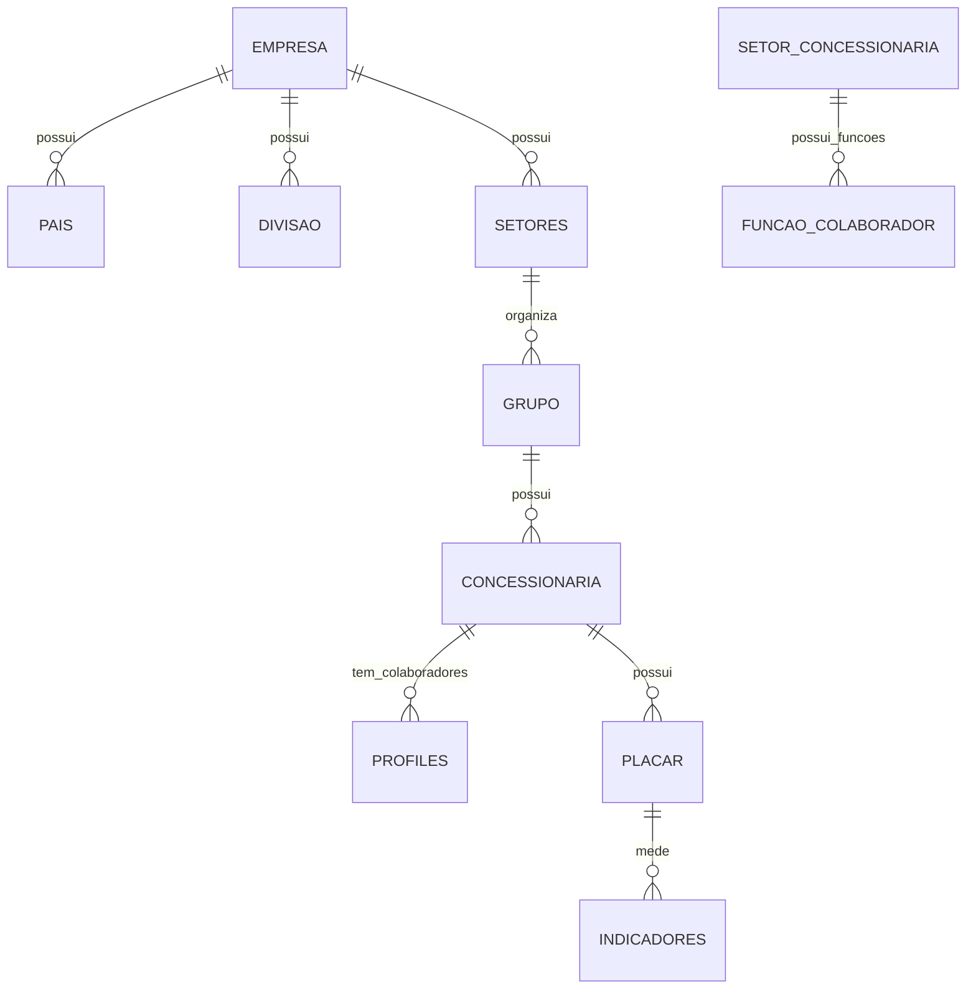

# PRD funcional — SerNissan reconstruído com IA

## Objetivo

Reconstruir o app SerNissan fora do Bubble, mantendo as funcionalidades existentes e melhorando performance, manutenção, segurança e clareza de regras de negócio.

## Usuários e perfis

O option set `perfil` indica a hierarquia de acesso:

| Perfil | Nível | db_value |
|---|---:|---|
| 01 - Individuando | 1 | `gerente_do_dom_nio` |
| 02 - Nissan | 2 | `gerente_regional` |
| 03 - Nissan Setor | 3 | `setor_adm` |
| 04 - Grupo Adm | 4 | `administrador_de_dom_nio` |
| 05 - Dealer Adm | 5 | `marketing_admin` |
| 06 - Area Adm | 6 | `area_adm` |
| 07 - Colaborador | 7 | `usu_rio` |

## Hierarquia organizacional

A estrutura principal é:

## Módulos funcionais

### 1. Autenticação e acesso

- Login por e-mail/senha.
- Recuperação de senha.
- Controle de usuário ativo/aprovado.
- Aceite/controle de cookies.
- Perfil hierárquico e contexto atual: empresa, país, divisão, setor, grupo, concessionária, área e função.

### 2. Admin corporativo

CRUDs principais:

- Empresa
- Países
- Divisões
- Setores
- Grupos
- Concessionárias
- Usuários
- Áreas e funções
- Biblioteca de indicadores
- Hábitos
- Solicitações

### 3. Placar de performance

- Criar placares por concessionária/data.
- Associar colaboradores e indicadores.
- Atualizar metas, valores, pesos, pontos e ranking.
- Permitir customização de metas com justificativa.
- Exibir ranking por colaborador, função, área e concessionária.
- Manter histórico de placares finalizados.

### 4. Indicadores

- Biblioteca de indicadores administrativos.
- Indicadores por placar/concessionária.
- Classe, unidade, importância, áreas e funções vinculadas.
- Importação/atualização por CSV ou API.
- Status ativo/inativo.

### 5. Agenda

- Calendário de compromissos/agendamentos.
- Vínculo com concessionária, grupo, setor, indicador ou usuário quando aplicável.
- Filtros por hierarquia e período.

### 6. Reunião de resultados

- Áreas, indicadores, ações, metas e resultados finais.
- Simuladores e dados de reunião.
- Relatórios preliminares/finais.

### 7. Competências

- Mapa de competências por função/área/concessionária.
- Calibração com autoavaliação, líder, follow-up e resultados.
- Hábitos, atitudes, ferramentas, conhecimentos, habilidades e treinamentos.

### 8. Visitas / RV

- Cadastro de relatório de visita.
- Participantes, próximos passos, anexos, foco e modalidade.
- Envio para ciência/assinatura pública por token.
- Status: rascunho, enviado, lembrete 1, lembrete 2, assinado, expirado.
- Registro de assinatura com IP, user agent, hash e horário.

### 9. Ajuda, pílulas e vídeos

- FAQ por categorias.
- Reprodutor de vídeo.
- Pílulas de conhecimento.

## Critérios de aceite gerais

- Cada rota deve verificar autenticação e permissões no servidor.
- Nenhuma listagem grande pode carregar tudo em memória.
- Toda busca deve ter paginação, filtros indexados e loading state.
- Toda mutation deve validar entrada com Zod.
- Todas as tabelas públicas do Supabase devem ter RLS ativado.
- Jobs pesados devem ser assíncronos e idempotentes.
