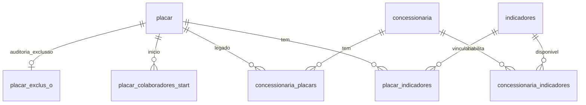

# Diagnóstico técnico — Placar (Fase 6A)

## Tabelas usadas nesta fase

| Tabela | Papel |
|--------|--------|
| `placar` | Entidade principal do placar de performance |
| `placar_indicadores` | N:N entre placar e indicadores da biblioteca |
| `placar_indicadores_start` | Snapshot inicial de indicadores (histórico Bubble) |
| `placar_colaboradores_start` | Colaboradores no início do placar |
| `concessionaria_placars` | N:N legado concessionária ↔ placar |
| `concessionaria_indicadores` | Indicadores habilitados por concessionária |
| `indicadores` | Indicadores vinculados ou candidatos ao placar |
| `concessionaria` | Escopo e rótulo de listagem |
| `empresa` | Escopo organizacional |
| `placar_exclus_o` | Auditoria de exclusões (nome, usuários, datas) |
| `app_options` (`opcoes_api`) | Opções de origem e acumulado |
| `feedback` | Relacionado a placar via FK (fora do escopo 6A) |

## Campos principais — `placar`

- `id`, `data`, `finalizado`, `ranking_atualizado`
- `empresa`, `concessionaria` (FK direta)
- `opcao_origem`, `opcao_acumulado` (valores de `app_options.opcoes_api`)
- `created_by`, `created_at`, `updated_at`

Não há campo `nome` na tabela; a identificação visual usa data + concessionária.

## Relacionamentos

- `placar.concessionaria` é a FK principal usada na Fase 6A.
- `concessionaria_placars` existe por legado Bubble; na criação sincronizamos o vínculo para compatibilidade.
- `indicadores.placar` aponta instâncias de indicador por placar (cálculo 6B); `placar_indicadores` define o conjunto de biblioteca vinculado.

## Lacunas do schema

- Sem views materializadas de ranking (`vw_placar_*` ainda não migradas).
- `ranking_atualizado` é flag; não há colunas de pontuação agregada na tabela `placar`.
- `placar_exclus_o` não referencia `placar.id` — é log textual/histórico.
- Duplicidade `placar.concessionaria` vs `concessionaria_placars` exige convenção de escrita.

## Riscos

- Cálculos pesados no Bubble eram jobs/RPC; replicar no client quebraria performance.
- Sincronizar `placar_indicadores` sem validar escopo da concessionária pode expor indicadores errados.
- Excluir placar finalizado pode perder histórico; bloqueamos delete quando `finalizado = true`.
- RLS atual é draft permissivo — não substitui políticas de produção.

## Proposta para Fase 6B

1. Jobs idempotentes para gerar/copiar indicadores ativos ao criar placar.
2. RPC ou Edge Function para recalcular pontos e `ranking_atualizado`.
3. Views ou tabelas agregadas para ranking por colaborador/função.
4. Popular `placar_colaboradores_start` e `placar_indicadores_start` no fluxo de abertura.
5. Integrar `feedback` e instâncias `indicadores` com `placar` preenchido.

## Evitar cálculos pesados no client

- Listagens sempre paginadas no servidor com colunas explícitas.
- Contagem de indicadores por placar via query agregada separada, não loop no browser.
- Ranking e pontos apenas leitura de agregados pré-calculados (6B+).
- `refreshPlacarAction` na 6A só revalida cache; sem recálculo.
