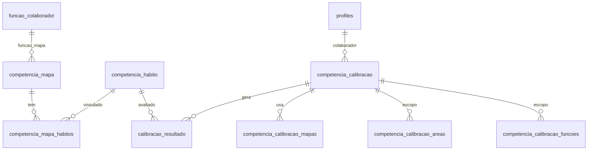

# Diagnóstico técnico — Competências (Fase 7A)

Fundação do módulo de Competências/Calibração. A matriz visual Sim/Parcial/Não fica para a Fase 7B.

## Tabelas usadas

| Tabela | Papel |
|--------|--------|
| `competencia_mapa` | Mapa de competência por função (versão, entrega, para_que + arrays de competências) |
| `competencia_mapa1`, `competencia_mapa2` | Duplicatas legadas idênticas — NÃO usadas (legado Bubble) |
| `competencia_habito` | Hábitos/itens de calibração (pergunta, peso, trilha, MV, essencial) |
| `competencia_mapa_habitos` | Join N:N mapa ↔ hábito |
| `competencia_calibracao` | Calibração por colaborador/concessionária (etapas em arrays) |
| `calibracao_resultado` | Resultado por hábito/competência e etapa (lider/auto/follow-up) |
| `competencia_calibracao_mapas` | Join calibração ↔ mapa |
| `competencia_calibracao_areas` | Join calibração ↔ setor_concessionaria |
| `competencia_calibracao_funcoes` | Join calibração ↔ função |
| `competencia_calibracao_resultados` | Join calibração ↔ resultado |
| `competencias` / `competencias_funcoes` | Catálogo legado de competências por função |
| `profiles` | Colaboradores elegíveis |
| `setor_concessionaria` | Área |
| `funcao_colaborador` | Função (FK do mapa) |
| `concessionaria` | Escopo |
| `app_options` | `competencia`, `calibracao_opcao`, `calibracao_cores`, `calibracao_resultado_tipo` |

## Campos principais

- `competencia_mapa`: `versao`, `entrega`, `para_que`, `funcao_mapa` (FK `funcao_colaborador`), `data`, arrays `atitudes`/`competencias_sernissan`/`ferramentas`/`habilidades`/`competencias_especificas`/`conhecimentos`/`treinamentos_e_learning`/`treinamentos_presenciais`. **Sem `nome`, sem `empresa`, sem `concessionaria`.**
- `competencia_habito`: `pergunta`, `descricao`, `mv`, `area` (TEXT livre), `peso`, `trilha`, `essencial`, `momento_de_verdade`. **Sem `empresa`.**
- `competencia_calibracao`: `colaborador` (FK auth.users), `concessionaria`, `data_calibracao`/`data_lider`/`data_follow_up`/`data_autocalibracao`, arrays `lider`/`followup`/`autocalibracao`.
- `calibracao_resultado`: `habito` (FK), `calibracao` (FK), `competencia` (text), `opcao_lider`/`opcao_colaborador`/`opcao_follow_up`, `pontos_*`, `tipo`.

## Relacionamentos

## Fluxos prováveis (Bubble)

1. Admin define mapas por função e vincula hábitos (`competencia_mapa_habitos`).
2. Calibração é criada para um colaborador/concessionária, referenciando mapas/áreas/funções.
3. Cada hábito recebe respostas por etapa (autocalibração, líder, follow-up) → `calibracao_resultado` com `opcao_*` (Sim=1, Parcial=0.3, Não=0).
4. Pontuação agregada por etapa e cores por faixa (`calibracao_cores`).

## Lacunas do schema

- `competencia_mapa` e `competencia_habito` não têm `empresa`/`concessionaria` → escopo direto impossível. Mapa é escopado indiretamente via `funcao_mapa → funcao_colaborador.empresa/area`. Hábito é efetivamente global.
- `competencia_habito.area` é TEXT livre, não FK para `setor_concessionaria`.
- `competencia_mapa` sem `nome`; identificação por `versao`/`entrega`/função.
- `competencia_mapa1/2` são duplicatas legadas (ignoradas).
- Respostas/etapas ficam em arrays de texto em `competencia_calibracao` + `calibracao_resultado`; a matriz exigirá normalização/leitura cuidadosa na 7B.

## Riscos

- Escopo fraco de mapas/hábitos pode expor catálogo entre empresas; mitigado em mapas via função, documentado para hábitos.
- A matriz de calibração tem volume alto (hábitos × colaboradores × etapas) → cálculo/filtros devem ficar no servidor (7B).
- Estruturas legadas (`competencia_mapa1/2`, `competencias`) podem confundir; não misturar.

## Como evitar cálculos/filtros pesados no client

- Listagens paginadas no servidor com colunas explícitas (sem `select('*')`).
- Filtros por query params resolvidos no banco.
- Contagem de hábitos por mapa via query agregada, não loop no client.
- Matriz e pontuação (7B) deverão usar agregação no servidor / RPC, nunca no browser.

## O que foi implementado na 7A

- Rotas `/competencias` (abas Mapas/Hábitos) e `/competencias/calibracao` (colaboradores elegíveis).
- CRUD base de mapas e hábitos (Server Actions + Zod), vínculo de hábitos ao mapa via `syncJoinTable('competencia_mapa_habitos')`.
- Listagem de colaboradores elegíveis com escopo organizacional.
- Permissões: acesso a todos os perfis (`max_nivel: usuário`); gestão de catálogo restrita a admin estrutural (nível ≤ 4).

## Decisão sobre migration 0006

- **Não criada nesta fase.** A fundação usa agregação em TypeScript e as join tables já existentes; nenhum objeto SQL novo foi necessário. Views/RPC de matriz e pontuação ficam para a Fase 7B (`0006_competencias_helpers.sql` quando houver necessidade real).

## Proposta para Fase 7B

- Matriz visual Sim/Parcial/Não por hábito × colaborador × etapa.
- Leitura/normalização de `calibracao_resultado` e arrays de `competencia_calibracao`.
- Pontuação por etapa e cores via `calibracao_cores`.
- Provável migration `0006_competencias_helpers.sql` (views/RPC de agregação).
- Fluxo de criação de calibração e gravação de respostas idempotente.

## Pendências para produção

- Escopo/RLS de catálogo de competências.
- Tratamento das tabelas legadas.
- `competencia_habito.area` como FK (decisão de modelagem).
